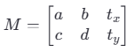
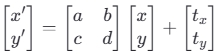

## 接口

1. **`cv2.split(m) -> mv`**

   - **`m`**：输入的多通道数组（如 BGR 图像）。

   - **`mv`**：返回一个元组，包含每个通道的单通道数组。

   - Notes:

     - 用于将一个多通道的数组（如图像）分离成几个单通道的数组。具体来说，它通常用来将彩色图像分解为独立的颜色通道

     - 输入为输入的多通道数组或图像

     - 返回值: 与输入图像通道数相同的多个单通道数组。对于BGR图像，返回三个单通道数组；对于BGRA图像，返回四个单通道数组

     - eg：

       ```
       b, g, r = cv2.split(image)
       ```

   - 如果输入的是单通道图像，则 `cv2.split` 不会产生任何效果，并且返回一个包含原始图像的元组。

   - 这个函数会创建新的 NumPy 数组来存储分离后的通道数据，因此如果对性能有严格要求，应当谨慎使用，因为它可能会消耗较多内存和处理时间。

   - 若要合并这些单通道数组回一个多通道数组，可以使用 `cv2.merge()` 函数

2. **`cv2.imread(filename[, flags]) -> retval`**

   - **`filename`**：要读取的图像文件路径。

   - **`flags`**：可选参数，指定如何读取图像（例如彩色、灰度或不改变原始图像）。默认是 `cv2.IMREAD_COLOR`。

   - Notes:

     - 从指定路径加载图像，并返回一个 NumPy 数组，该数组表示图像的数据。如果图像无法加载（例如文件不存在或格式不支持），则返回 `None`

     - cv的颜色空间是BGR，所以一般还需要做一个颜色空间的转换

       ```
       img_rgb = cv2.cvtColor(img, cv2.COLOR_BGR2RGB)  # 转换颜色空间为RGB
       ```

3. **`cv2.cvtColor(src, code[, dstCn]) -> dst`**

   - **`src`**：输入图像。
   - **`code`**：颜色空间转换代码，例如 `cv2.COLOR_BGR2RGB`、`cv2.COLOR_BGR2GRAY` 等。
   - **`dstCn`**：目标图像中的通道数。如果给出，则会覆盖从 `code` 推断出的默认值。通常情况下不需要指定。
   - Notes:
     - 用于颜色空间转换的函数。`cv2.COLOR_BGR2RGB` 是一个预定义的常量，表示从 BGR 到 RGB 的转换

4. **`cv2.imwrite(filename, img[, params])`**

   - 用于将图像保存到文件

5. **`cv2.merge(mv) -> retval`**

   - **`mv`**：必需参数，是一个列表或元组，包含要合并的单通道 NumPy 数组。每个数组应该具有相同的形状。
   - **`retval`**：返回值，是一个多通道的 NumPy 数组，其中每个输入数组成为输出数组的一个通道。

6. **`cv2.getRotationMatrix2D(center, angle, scale) -> M`**

   - 用于获取二维旋转矩阵
   - **`center`**：旋转中心点的坐标 `(x, y)`，通常是图像的中心，但也可以是其他任意点。
   - **`angle`**：旋转角度（以度为单位）。正值表示逆时针旋转，负值表示顺时针旋转。
   - **`scale`**：缩放因子。它可以是一个浮点数，用于同时调整图像的大小和旋转。如果只想旋转而不改变大小，则设置为 1.0。

   - **`M`**：一个形状为 (2, 3) 的 NumPy 数组，表示旋转矩阵。这个矩阵包含旋转和平移信息，可以传递给 `cv2.warpAffine` 来执行实际的图像变换。

7. **`cv2.warpAffine(src, M, dsize[, dst[, flags[, borderMode[, borderValue]]]]) -> dst`**

   - 用于对图像应用仿射变换
   - **`src`**：输入图像（源图像），可以是灰度或彩色图像。
   - **`M`**：2x3 的仿射变换矩阵，通常由 `cv2.getRotationMatrix2D` 或其他方式生成。
   - **`dsize`**：输出图像的尺寸 `(width, height)`，指定变换后的图像大小。
   - **`dst`**：可选参数，输出图像（目标图像）。如果未提供，则会根据 `dsize` 和 `src` 的类型自动创建。
   - **`flags`：**插值方法，默认为`cv2.INTER_LINEAR`。
   - **`borderMode`：**边界填充模式，默认为`cv2.BORDER_CONSTANT`。
   - **`borderValue`**：当 `borderMode=cv2.BORDER_CONSTANT` 时使用的填充颜色，默认为黑色 (0)。

   - **`dst`**：变换后的输出图像。
   - Notes：
     - 仿射变换是一类几何变换，它保持了点之间的共线性和平行线之间的距离比例不变。这类变换包括平移、旋转、缩放、剪切等操作
     - 在 OpenCV 中，仿射变换矩阵通常是一个 2x3 的浮点数矩阵：
     - *a*,*b*,*c*,*d* 控制旋转、缩放和剪切。
     - tx,ty 控制平移。
     - 对于任意一个点 (x,y)，其经过仿射变换后的坐标 (x′,y′)可以通过以下公式计算：

8. **`cv2.resize(src, dsize[, dst[, fx[, fy[, interpolation]]]]) -> dst`**

   - 用于调整图像的尺寸。允许根据指定的宽度和高度或缩放因子来改变图像的大小，并提供了多种插值方法以确保变换后的图像质量。
   - **`src`**：输入图像（源图像），可以是灰度或彩色图像。
   - **`dsize`**：输出图像的尺寸 `(width, height)`。如果设置了 `fx` 和 `fy`，则此参数可以为 `(0, 0)`，表示将根据缩放因子自动计算尺寸。
   - **`dst`**：可选参数，输出图像（目标图像）。如果未提供，则会根据 `dsize` 和 `src` 的类型自动创建。
   - **`fx`**：沿 x 轴（宽度方向）的缩放因子，默认值为 0.0，意味着不使用此参数进行缩放。
   - **`fy`**：沿 y 轴（高度方向）的缩放因子，默认值为 0.0，意味着不使用此参数进行缩放。
   - **`interpolation`**：插值方法，默认为 `cv2.INTER_LINEAR`。
   - **`dst`**：调整尺寸后的输出图像。
   - Notes：
     - 指定新的宽度或高度时，通常希望保持图像的纵横比不变。可以通过计算另一个维度的比例来实现这一点。
     - 不同的插值方法适用于不同的场景。例如，`cv2.INTER_AREA` 对于缩小图像效果较好，而 `cv2.INTER_CUBIC` 可以在放大图像时提供更好的质量但计算成本较高


​			


## 零碎知识

1. **像素值0为黑色**

2. **透明度**

   1. Alpha 通道，是图像中的一个额外通道，用于定义每个像素的不透明程度。在数字图像中，通常的颜色模型是 RGB（红、绿、蓝），而带有透明度的图像则使用 RGBA 模型，在 RGB 之后添加了一个 Alpha 通道。Alpha 值可以是一个从 0 到 255 的整数（对于8位图像），其中：

      1. **0** 表示完全透明，
      2. **255** 表示完全不透明，
      3. 中间值表示不同程度的半透明。

   2. **图像格式支持**：并不是所有的图像格式都支持透明度。例如，PNG 和 TIFF 支持 Alpha 通道，而 JPEG 不支持。

   3. **颜色与透明度结合**：当一个图像包含 Alpha 通道时，每个像素的颜色信息（RGB）和它的透明度（Alpha）共同决定了该像素如何显示。在合成或叠加图像时，Alpha 通道决定了底层图像有多少会透过上层图像显现出来。

   4. **视觉效果**：透明度允许创建诸如阴影、渐变边缘、玻璃效果等更加真实和复杂的效果，因为它们可以模拟物体之间的部分遮挡。

   5. Alpha 通道是一个二维数组，因为它需要为图像中的每一个像素指定一个透明度值。这个二维数组的尺寸正好与图像的宽度和高度相匹配，也就是说，它有相同的行数和列数，以确保每个像素点都能有一个对应的 Alpha 值来控制其透明度。

      例如，如果有一张分辨率为 800x600 的图像，那么它的 Alpha 通道也将是一个 800x600 的数组，其中每个元素都是一个从 0 到 255 的值（或等效的小数值），用来描述相应位置上像素的透明度。

3. **旋转角度的正负**：正的角度代表逆时针旋转，而负的角度代表顺时针旋转		

